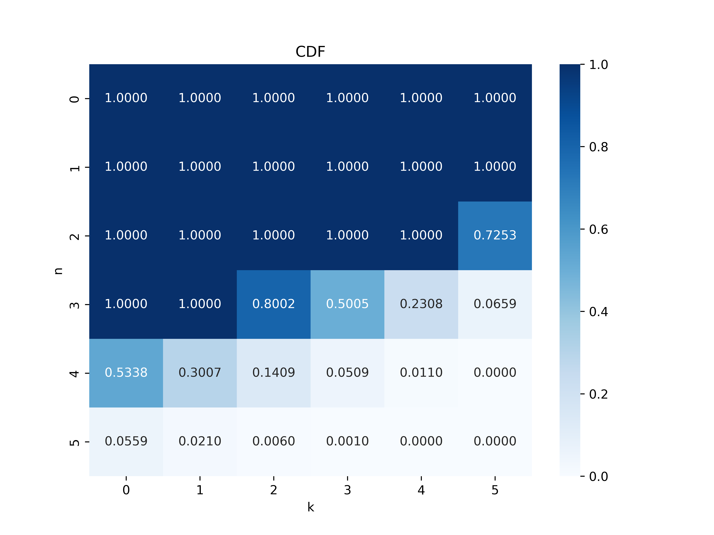

# Lier's-Bar-Assist

This app helps you lie with increased confidence: it tells you the probability of：

- one of your friends having a certain number of cards in their hand
- one of your friends having more than a certain number of cards in their hand

given the cards you have seen.

> "How many cards will they have?"

> "How many cards will they have more than?"
